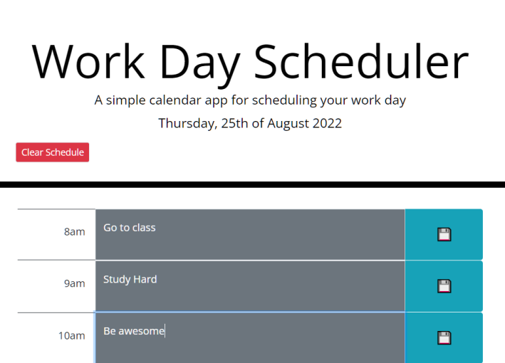
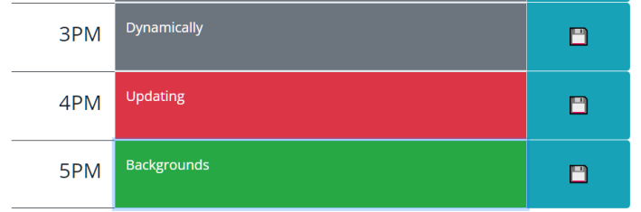

# Daily Planner

## Description
This work-day scheduler was a test of various skills:
- Bootstrap
- jquery
- moment.js
- The setInterval() and setTimeout() functions
- Utilizing local memory for storage

It has the following features:
- Text fields to enter tasks freely
- Save buttons to record data locally
    - A confirmation will show on screen every time your data is saved.
- A "Clear Schedule" button to remove local data storage
- Background colors that change based on the time of day for better organization
    - Hours highlighted in green have not yet passed
    - The hour highlighted in red are the current our
    - Hours highlighted in grey have already passed
- Background colors that update every hour (within 1 minute) to ensure that tasks are properly prioritized

## Installation
N/A

## Usage

See the published site: [here](https://stevengoldbergm.github.io/daily-planner/)
- To use the app, simply click inside your desired text entry field, write down your desired task, and tap on the floppy disc to save your data. 
- If you wish to reset the scheduler, click the "Clear Schedule" button to remove all saved data from your device.

## License
N/A